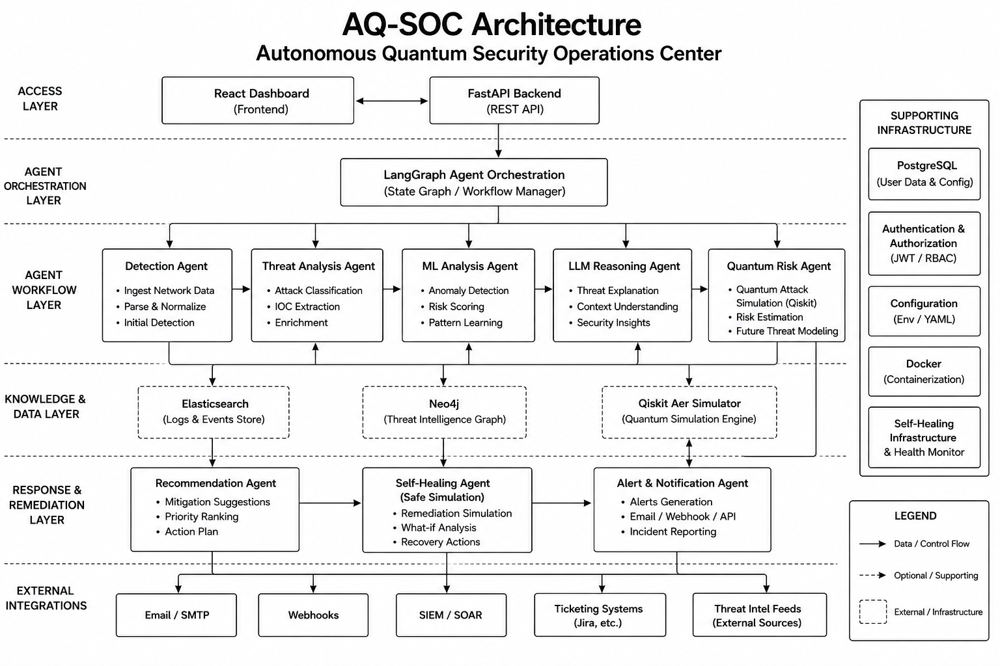
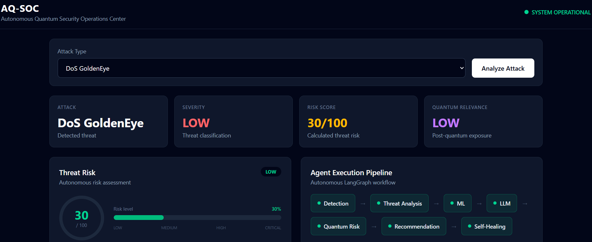
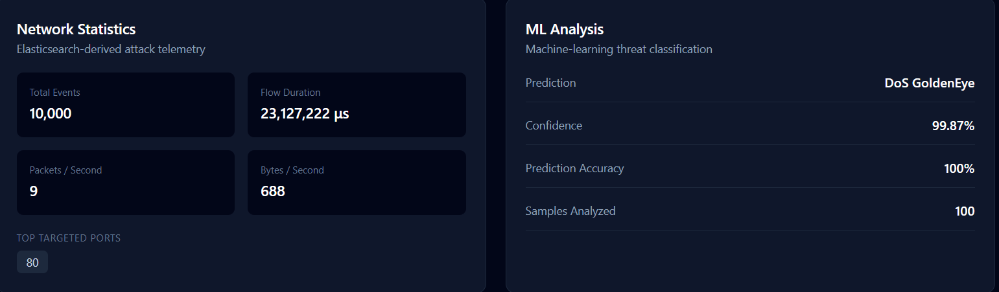
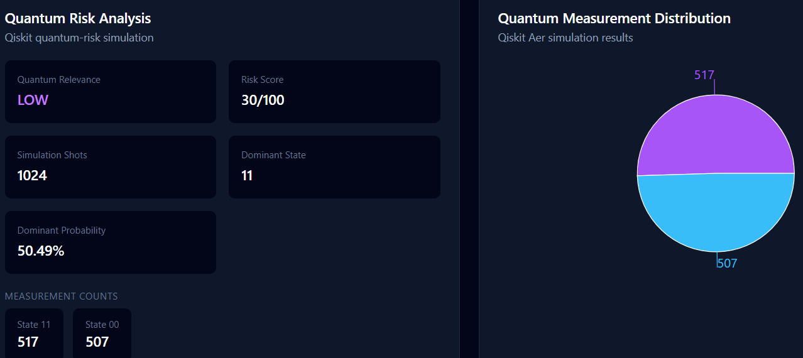
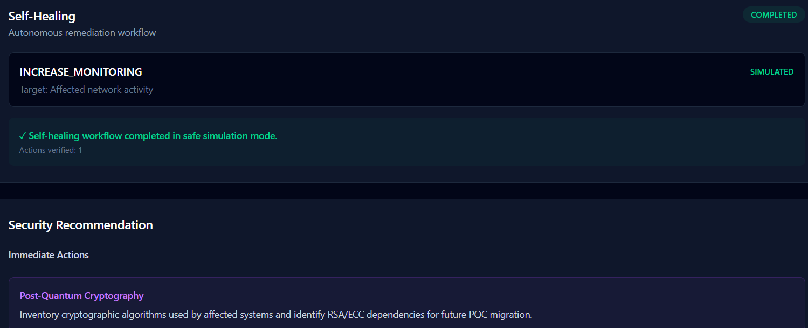

# Autonomous Quantum Security Operations Center (AQ-SOC)

An autonomous cybersecurity operations platform that combines AI-driven threat detection, machine learning, LLM-based security reasoning, quantum-risk analysis, and graph-based threat intelligence.

## System Architecture

## Technologies
 Backend
- Python
- FastAPI
- LangGraph
- Pydantic
- Elasticsearch
- Neo4j
- Scikit-learn
- Random Forest
- LLM (Ollama)
- Qiskit Aer 
- Docker & Uvicorn

Frontend
- React & Lucid React
- Vite
- Tailwind CSS
- Recharts
- Axios

## Capabilities

- Network attack detection and traffic analysis using Elasticsearch
- Automated threat severity and risk assessment
- ML-based network attack classification using Random Forest
- LLM-based security reasoning and threat interpretation
- Quantum-risk assessment using Qiskit Aer simulation
- Automated security recommendations and PQC migration guidance
- Graph-based threat intelligence and relationship storage using Neo4j
- Agent orchestration using LangGraph
- Autonomous self-healing workflow with safe remediation simulation and verification
- Real-time security monitoring through a React-based dashboard

## Dataset

The system uses the CICIDS2017 cybersecurity dataset.

The dataset itself is not included in this repository because of its size.

## Screenshots

### AQ-SOC Security Dashboard

### Network & ML Analysis

### Quantum Risk Analysis

### Self-Healing Details

